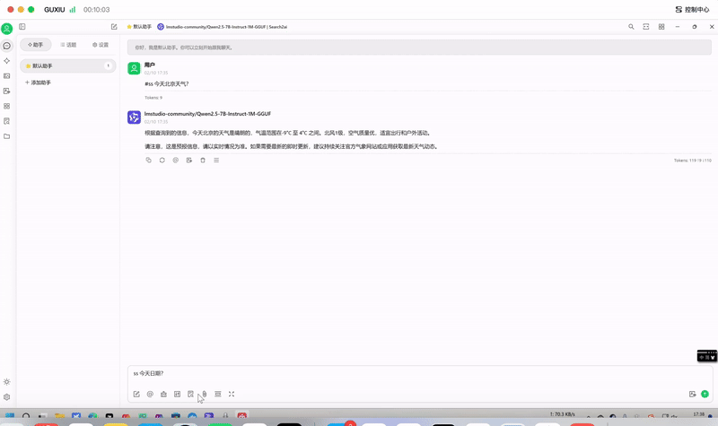

# LLM Search Plus

让LLM支持联网搜索

效果：



## 联网搜索逻辑：

Chat客户端发送内容中携带 #search、/search、/ss 或 #ss 强制开启联网搜索，否则由模型自行判断。

## 目前支持搜索引擎：

- Google
- SearxNG

## 本地模型服务：

- LM Studio

或者其他兼容OpenAI API的服务。

## 使用方法

### 1. 本地运行

前提：本地已有Python环境，或者自行安装：[https://www.anaconda.com/download/success](https://www.anaconda.com/download/success)，建议下载Miniconda。

**拷贝项目到本地：**

    git clone https://github.com/nocmt/LLMSearchPlus.git

**安装环境：**

    cd LLMSearchPlus && pip install -r requirements.txt && cp .env.template .env

修改.env其中的配置。

**运行：**

    python main.py


在Chat客户端使用，URL填写：[http://127.0.0.1:8100](http://127.0.0.1:8100)，可能要加/v1，和使用LM Studio并没有什么区别，请自行测试确定。


#### 2. 使用Docker部署

**修改配置文件**

docker-compose.yml 文件中，需要修改LM Studio的局域网IP地址，建议和SEARXNG一起部署，这样SEARXNG的地址就是[http://searxng:8080](http://searxng:8080)，否则需要自行处理容器网络问题。


searxng 的配置文件，具体在 `.searxng` 目录下，有一个`secret_key`需要手动生成，根据系统的不同执行命令不一样，只需要生成1次。


Windows 用户可以使用以下 powershell 命令生成密钥：


```powershell
$randomBytes = New-Object byte[] 32
(New-Object Security.Cryptography.RNGCryptoServiceProvider).GetBytes($randomBytes)
$secretKey = -join ($randomBytes | ForEach-Object { "{0:x2}" -f $_ })
(Get-Content .searxng/settings.yml) -replace 'ultrasecretkey', $secretKey | Set-Content .searxng/settings.yml
```

Linux、Mac 用户可以使用以下 bash 命令生成密钥：

```bash

sed -i "s|ultrasecretkey|$(openssl rand -hex 32)|g" .searxng/settings.yml

```


这样它会生成一个32位的密钥，并自动替换掉ultrasecretkey。


全部修改好后，启动服务：


**启动服务：**

    docker compose up -d


**查看日志：**

    docker-compose logs -f

**停止删除服务：**

    docker-compose down


## 其他

#### 构建镜像

    docker build -t llm-search-plus .

#### 运行容器

    docker run -d -p 8100:8100 --name llm-search-plus llm-search-plus
