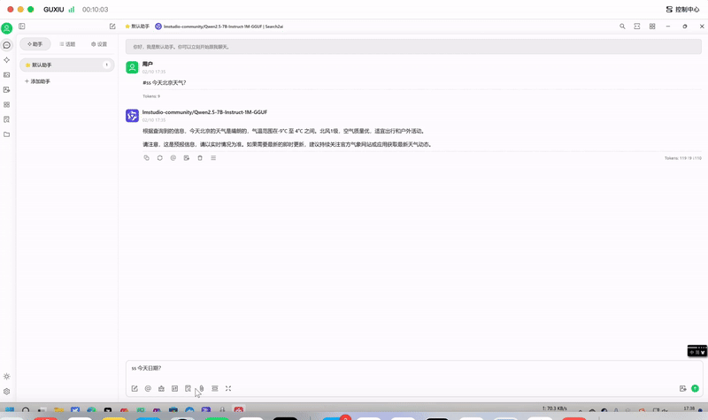
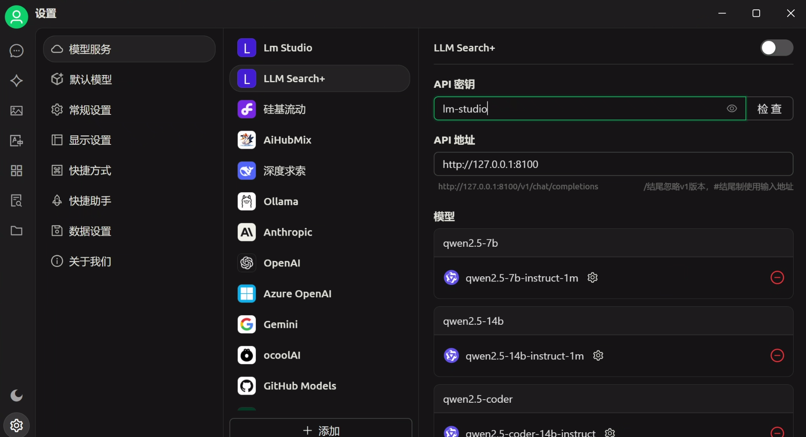

# LLM Search Plus

Enable LLM with internet search capability

[中文文档](./README.md) | [Engish](./README_EN.md)

Effect:



## Internet Search Logic:

Chat client will force enable internet search when the message contains #search, /search, /ss or #ss, otherwise it will be determined by the model itself.

## Currently Supported Search Engines:

- Google: [How to register for google custom search api cx key](https://blog.csdn.net/whatday/article/details/113750998)
- SearxNG

## Local Model Service:

- LM Studio

Or other services compatible with OpenAI API.

## Usage

If you have already deployed Searxng or applied for Google search engine's CX and KEY, it's recommended to modify the .env environment variables and run locally (local running requires Python environment, recommended to install from official website). Otherwise, deploy directly with Docker Compose, which is simple and quick.

### 1. Local Running

Prerequisite: Python environment is already installed locally, or install it yourself: [https://www.anaconda.com/download/success](https://www.anaconda.com/download/success), recommend downloading Miniconda.

**Clone the project locally:**

    git clone https://github.com/nocmt/LLMSearchPlus.git

**Install environment:**

    cd LLMSearchPlus
    pip install -r requirements.txt
    cp .env.template .env

Modify the configuration in .env.

Environment variable meanings:

| KEY             | Default Value         | Meaning                                                                                                                          |
| --------------- | --------------------- | -------------------------------------------------------------------------------------------------------------------------------- |
| SEARCH_ENGINE   | searxng               | Currently only supports google, searxng                                                                                          |
| OPENAI_BASE_URL | http://127.0.0.1:1234 | Use LM-Studio to start service, and enable `Allow service in LAN` and `Enable CORS`. It also supports other OpenAI API services. |
| NUM_RESULTS     | 3                     | Number of search results, avoid too many contents causing timeout                                                                |
| GOOGLE_CX       | ""                    | Google search CX value, required when SEARCH_ENGINE=google                                                                       |
| GOOGLE_API_KEY  | ""                    | Google search API KEY value, required when SEARCH_ENGINE=google                                                                  |
| SEARXNG_URL     | http://127.0.0.1:8101 | Required when SEARCH_ENGINE=searxng                                                                                              |

**Run:**

    python main.py

When using in Chat client, fill in URL: [http://127.0.0.1:8100](http://127.0.0.1:8100), might need to add /v1, not much different from using LM Studio, please test and determine yourself.



### 2. Deploy with Docker Compose


**Modify Configuration File**


In docker-compose.yml file, you need to modify LM Studio's LAN IP address (use LM-Studio to start service, and enable `Allow service in LAN` and `Enable CORS`). It's recommended to deploy together with SEARXNG, so SEARXNG's address will be [http://searxng:8080](http://searxng:8080), otherwise you need to handle container network issues yourself.


For searxng's configuration file, specifically in the `.searxng` directory, there's a `secret_key` that needs to be manually generated. The command varies depending on the system, only needs to be generated once.


Windows users can use the following powershell command to generate the key:

```powershell

```powershell
$randomBytes = New-Object byte[] 32
(New-Object Security.Cryptography.RNGCryptoServiceProvider).GetBytes($randomBytes)
$secretKey = -join ($randomBytes | ForEach-Object { "{0:x2}" -f $_ })
(Get-Content .searxng/settings.yml) -replace 'ultrasecretkey', $secretKey | Set-Content .searxng/settings.yml
```

Linux, Mac users can use the following bash command to generate the key:

```bash

sed -i "s|ultrasecretkey|$(openssl rand -hex 32)|g" .searxng/settings.yml

```

This will generate a 32-bit key and automatically replace ultrasecretkey.

After all modifications are done, start the service:

**Start Service:**

    docker compose up -d


If it returns errors like ERROR: failed to authorize, pull the python image first then execute `docker compose up -d`。

    docker pull python:3.11-slim

View Logs:

    docker-compose logs -f

**Stop and Remove Service:**

    docker-compose down


## Others

### Build Image Yourself Build Image


**Build Image:**

    docker build -t llm-search-plus .
 
 
**Start Container:**

    docker run -d -p 8100:8100 --name llm-search-plus llm-search-plus

### Searxng Optimization

If you find the internet search content incorrect or not comprehensive, it's recommended to modify its search engines. 

Open http://localhost:8101/preferences and turn off some search engines. 

For example, I only kept Bing and Google, and the results became correct.